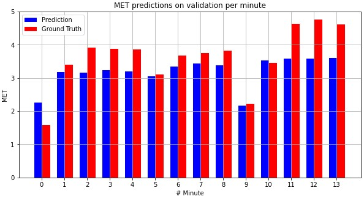
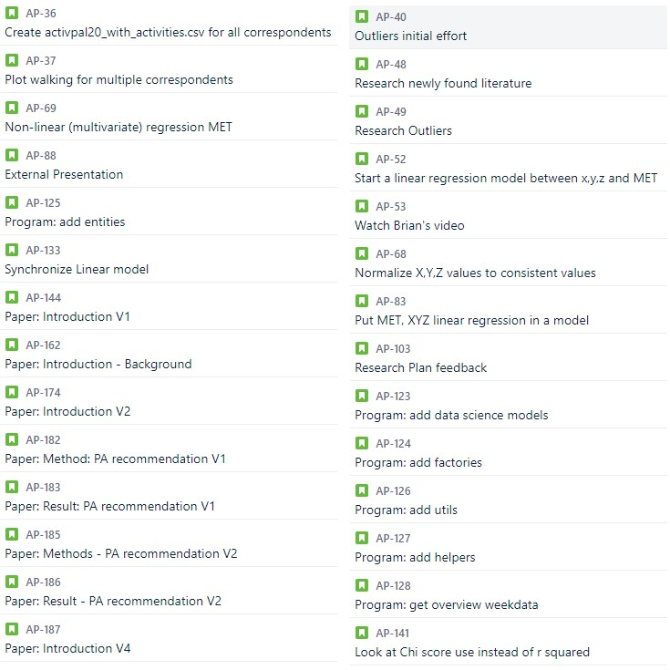

# Portfolio
Portfolio of: Ali Safdari

Student number: 17017211

Project: activPAL

## Datacamp courses
| Course | Certificate |
| ----------- | ----------- |
| Introduction to python | [certificate](evidence/courses/introduction-to-python.pdf) |
| Intermediate Python	 | [certificate](evidence/courses/intermediate-python.pdf) |
| Python Data Science Toolbox (Part 1)	 | [certificate](evidence/courses/python-data-science-toolbox-part1.pdf) |
| Python Data Science Toolbox (Part 2)	 | [certificate](evidence/courses/python-data-science-toolbox-part2.pdf) |
| Pandas Foundations	 | [certificate](evidence/courses/pandas-foundations.pdf) |
| Introduction to Data Visualization in Python	 | [certificate](evidence/courses/introduction-to-data-visualization-in-python.pdf) |
| Manipulating Dataframes with pandas	 | [certificate](evidence/courses/manipulating-dataframes-with-pandas.pdf) |
| Data Types for Data Science in Python	 | [certificate](evidence/courses/data-types-for-data-science-in-python.pdf) |
| Cleaning data in Python	 | [certificate](evidence/courses/cleaning-data-in-python.pdf) |
| Preprocessing for Machine Learning in Python	 | [certificate](evidence/courses/preprocessing-for-machine-learning-in-python.pdf) |
| Merging DataFrames with pandas	 | [certificate](evidence/courses/merging-dataframes-with-pandas.pdf) |
| Exploratory data analysis in Python	 | [certificate](evidence/courses/exploratory-data-analysis-in-python.pdf) |

# Reflection and evaluation
## Reflection on own contribution to the project
[Read here](pages/reflection/own-contributions.md)

## Reflection on own learning objectives
[Read here](pages/reflection/learning-objectives.md)

## Evaluation on the group project as a whole
[Read here](pages/reflection/group-evaluation.md)

## Research project
### Task definition
In the research plan document I helped to describe the research questions.

[Read more](pages/research-project/task-definition.md)

### Conclusions
The conclusion of our research can be found in the research paper and final presentation. I wrote the conclusion in the presentation of week 18.

[Read more](pages/research-project/conclusions.md)

### Planning
Week 2 to the end of the project I had the role of Scrum Master. Therefore, I was responsible for making sure the team was performing optimally in the Scrum way. 

[Read more](pages/research-project/planning.md)

## Domain knowledge
### Introduction of the subject field
In our research paper I worked on multiple iterations of the introduction chapter.

[Read more](pages/domain-knowledge/introduction.md)

### Literature research
During the project I have read literature, shared its information with the team so we could use it for the project.

[Read more](pages/domain-knowledge/literature-research.md)

### Explanation of Terminology, Jargon and definitions
In the research paper I explain terms the user should know in the introduction.

[Read more](pages/domain-knowledge/terminology.md)

## Data preprocessing
### Data exploration
In order to understand the data I created plots about each activity. In addition, I attempted to remove outliers from the activPAL data.

[Read more](pages/data-preprocessing/data-exploration.md)

### Data cleansing
The data we got from CBS did not include data of all the respondents. With the data we did get, my team mates and I encountered some issues. So I decided to investigate the data files we received while Colin sent an email to Annemieke regarding some (missing) respondent data files.

[Read more](pages/data-preprocessing/data-cleansing.md)

### Data preparation
In order to get the data ready to be used in a model, I applied data preprocessing practices on the data.

[Read more](pages/data-preprocessing/data-preparation.md)

### Data visualization (exploratory)
I created plots to gain insights in the data, testing hypothesis from literature and knowing how many features to select.

[Read more](pages/data-preprocessing/data-visualization.md)

## Predictive analytics
### Selecting a model
Early on it became clear we would need multiple MET regression models. One for each activity. In my case, I worked on linear regression because [((Sasaki et al., 2016, p. 34))](https://doi.org/10.1016/b978-0-12-802075-3.00002-4) states there is a linear relationship between energy expenditure and movement acceleration. 

### Training a model
After my models were done training, I have analyzed the validation sores.

[Read more](pages/predictive-analytics/model-training.md)

### Evaluating a model
For the linear regression models I have used 5-fold cross validation to try and improve the model. Moreover, I take a look at the test set scores. 

[Read more](pages/predictive-analytics/model-evaluation.md)

### Visualizing the outcome of a model
I have used a grouped bar chart to visualize the evaluation metrics for all linear regression models. Here is an example of one:

Note: the function that was used to plot these visualization has been created by Colin. 

## Communications
### Presentatioins
In this table are all the presentations that I presented on my own:
| **Date** | **Presentation** |
|-|-|
| 07-09-2020 | [Internal presentation](evidence/presentations/07-09-2020-internal-presentation-week-1.pdf) |
| 30-10-2020 | [External presentation](evidence/presentations/30-10-2020-external-presentation-week-2.pdf) |
| 23-11-2020 | [Internal presentation](evidence/presentations/23-11-2020-internal-presentation-week-11.pdf) |
| 14-12-2020 | [Internal presentation](evidence/presentations/14-12-2020-internal-presentation-week-15.pdf) |

### Writing paper
Here is a list of parts I wrote for the research paper:
* Introduction: iterations 1, 2 and 4
* Helped Adnan with spelling/grammar for "*Activity Classification*" in Methods
* All iterations of "*International recommendation of PA*" in Methods
* All iteration of "*International recommendation of PA*" in Results

[Proof](evidence/documents/Research-paper-iterations.pdf)

## Python notebooks
Here is a list of notebooks/python files I mostly worked on myself:
* [Data-preprocessing_activpal20_all_respondents_walking](evidence/notebooks/Data-preprocessing_activpal20_all_respondents_walking.pdf)
* [Data-preprocessing_respondents_csv](evidence/notebooks/Data-preprocessing_respondents_csv.pdf)
* [linear_regression_XYZ_MET](evidence/notebooks/linear_regression_XYZ_MET.pdf)
* [linear_regression_XYZ_MET-walking_old](evidence/notebooks/linear_regression_XYZ_MET-walking_old.pdf)
* [linear_regression_XYZ_MET-walking](evidence/notebooks/linear_regression_XYZ_MET-walking.pdf) 
* [linear_regression_XYZ_MET-walking-new](evidence/notebooks/linear_regression_XYZ_MET-walking-new.pdf)
* [linear_regression_XYZ_MET-running_old](evidence/notebooks/linear_regression_XYZ_MET-running_old.pdf)
* [linear_regression_XYZ_MET-running](evidence/notebooks/linear_regression_XYZ_MET-running.pdf)
* [linear_regression_XYZ_MET-running-new](evidence/notebooks/linear_regression_XYZ_MET-running-new.pdf)
* [linear_regression_XYZ_MET-cycling-light-new](evidence/notebooks/linear_regression_XYZ_MET-cycling-light-new.pdf)
* [linear_regression_XYZ_MET-cycling-heavy-new](evidence/notebooks/linear_regression_XYZ_MET-cycling-heavy-new.pdf)
* [linear_regression_XYZ_MET-cycling](evidence/notebooks/linear_regression_XYZ_MET-cycling.pdf)
* [linear_regression_XYZ_MET-standing](evidence/notebooks/linear_regression_XYZ_MET-sitting.pdf)
* [linear_regression_XYZ_MET-sitting](evidence/notebooks/linear_regression_XYZ_MET-standing.pdf)
* [plot_basic_activities](evidence/notebooks/plot_basic_activities.pdf)
* [plot_walking_all_correspondents](evidence/notebooks/plot_walking_all_correspondents.pdf)
* [MetRegressionDataPreparingUtils.py](evidence/notebooks/MetRegressionDataPreparingUtils.py)
* [ActivPalUser.py](evidence/notebooks/ActivPalUser.py)
* [ActivPalUserFactory.py](evidence/notebooks/ActivPalUserFactory.py)

Here is a list of notebooks/python files I contributed to:
* [pandas_helper.py](evidence/notebooks/pandas_helper.py)
* [math_helper.py](evidence/notebooks/math_helper.py)
* [removing_outliers](evidence/notebooks/removing_outliers.pdf)
* [Application main](evidence/notebooks/main_nb.pdf)

<u>Note</u>: there are multiple verions of the functions below in the notebooks. The first version were created by Coling and me. Later I refactored these functions.
* *get_regression_df*
* *get_vyntus_df*
* *get_raw_df*
* *get_timestamps*

<u>Note</u>: the *get_speed* method in almost all notebooks, except in any "*linear_regression_XYZ_MET-*[ACTIVITY]*-new*" notebooks is created by Adnan. In the notebooks previously mentioned, it is created by me. 

<u>Note</u>: the function in the linear regression notebooks that visualizes the outcome of the models is created by Colin.

<u>Note</u>: regarding the files for the application (ActivPalUser, ActivPalUserFactory, MetRegressionDataPreparingUtils, application main) Adnan created the infrastructure and I implemented these parts.

## Scrum tickets
Below I added a screenshot of all the Scrum tickets I was involved with. On the left side are tickets that are assigned to my name only. On the right side are tickets of which I am one of the assignees.

