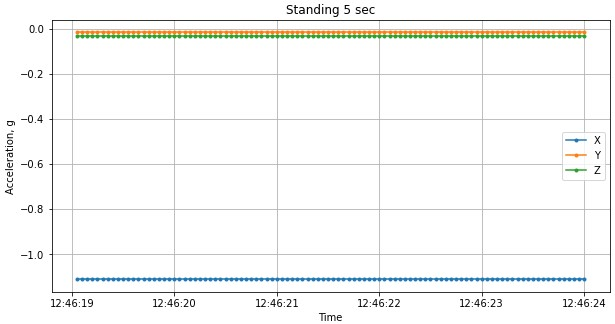
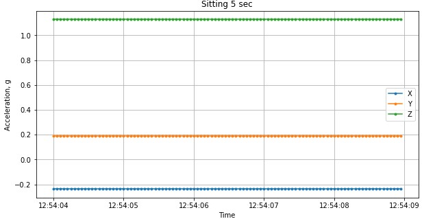
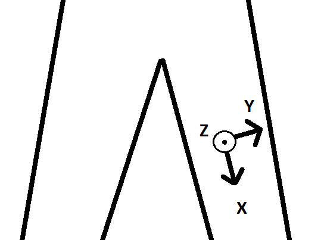
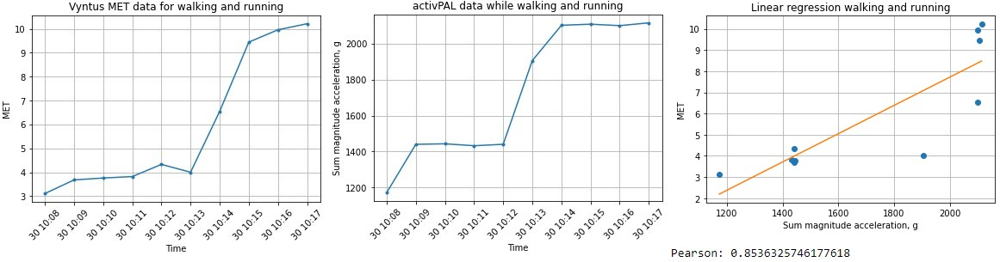
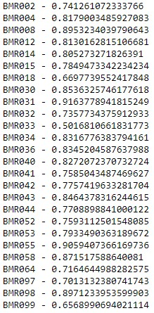

# Data exploration

## Plot basic activities
In order to try and understand the data I had the idea of creating plots of the X, Y and Z columns for each activity. I created the plots in [this](/evidence/notebooks/plot_basic_activities.pdf) notebook.

In this notebook I plot 5 seconds worth of X, Y and Z data for all activities except jumping which is 2.5 seconds.

By looking at the standing plot I learned that the force of gravity (1 G) is being applied on the X axis because it has a value of -1 G.

By looking at the plot for sitting the force of gravity is mostly applied on the Z axis.

Knowing this information one is able to infer the orientation of the axes. Which I believe is the orientation shown in the image below.

>van Hees, V. (2019, 30 mei). Direction of accelerometer axes. [Illustration]. https://medium.com/@vincentvanhees/activity-type-recognition-with-an-accelerometer-worn-on-the-thigh-during-eurovision-song-contest-3d413f55f5fb

## Plot correlation MET and magnitude of acceleration
In order to explore the relationship between the summation of magnitude of acceleration per epoch and the actual MET value, I created an univare linear regression notebook which can be found [here](/evidence/notebooks/linear_regression_XYZ_MET.pdf). 

In this notebook I plot the MET and summation of magnitude of acceleration for a single respondent of the walking and running activities. 
When comparing the two plots visually, there seems to be a strong correlation. The Pearson correlation score also seems to indicate this.

After looking at the Pearson correlations between met and summation of magnitude of acceleration for walking and running activities of all respondents, I knew this single example is not because of coincidence. 

## Removing outliers
In an effort to remove the outliers in the activPAL data, Colin and I started working on [this](/evidence/notebooks/removing_outliers.pdf) notebook. In essence, we thought an outlier would be a X, Y or Z value that is far off from the mean of that column. So we used percentiles to remove the lower and upper 1% of values from each column. Later we found out that these values are not outliers and it is wrong to remove them as if they were. These values are just the lower and upper bounds of a movement, for example when the foot hits the floor or reaches the top while walking or running.