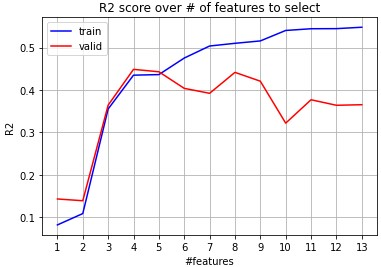

# Data preparation

## Removing missing values
### In Machine Learning model notebooks:
In any of the "*linear_regression_XYZ_MET-*[ACTIVITY]*-new*" notebooks I check the training and test set for missing values before proceeding. For example [this](/evidence/notebooks/linear_regression_XYZ_MET-walking-new.pdf) one. Luckily there were no missing values. If there would be a few missing values, I would delete them. If most values within a column is missing, I would delete that column. If there are many missing values in rows, I would have to fill those missing values with a value that makes sense, for example an average value.

### In data-preprocessing respondents notebook:
Later I decided to create a notebook that handles data-preprocessing for the respondents data file. The notebook can be found [here](/evidence/notebooks/Data-preprocessing_respondents_csv.pdf). Luckily the data file did not contain any missing values. If it did I would handle them the same way I described previously. 

## Convert to numerical values
### In Machine Learning model notebooks:
In any of the "*linear_regression_XYZ_MET-*[ACTIVITY]" notebooks I convert any non-numerical values to numerical ones. For example in [this notebook](/evidence/notebooks/linear_regression_XYZ_MET-walking.pdf) function "*get_regression_df*":

`new_df['gender'] = int(respondents_df['geslacht'][res_number].replace('vrouw',str(0)).replace('man', str(1)))`

Note: in these notebooks, regarding the conversion to numericals, the function "*conver_age_to_number*" I did not create but Colin did. 

### In data-preprocessing respondents notebook:
In the function "*convert_respondents_values_to_numerical*" in the [data-preprocessing respondents notebook](/evidence/notebooks/Data-preprocessing_respondents_csv.pdf) I use the "*apply*" function with "*lambda*" to create binary variables. For example:

`respondents_df.gender = respondents_df.gender.apply(lambda x: x == 'man').astype(int)`

In case of the age category, I use the "*replace*" function with a dictionary object to create a categorical variable.

`age_category = {"15-19": 0, "20-24": 1, "25-29": 2, "30-34": 3, "35-39": 4,  "40-44": 5, "45-49": 6, "50-54": 7, "55-59": 8,  "60-64": 9, "65-69": 10,  "70-74": 11, "75-79": 12}`
`respondents_df.age_category.replace(age_category, inplace=True)`

## Derive features
### Remove low variance:
In the [data-preprocessing respondents notebook](/evidence/notebooks/Data-preprocessing_respondents_csv.pdf) I remove features with low variance. Low variance features are not informative, thus not useful to have as a feature. The "*VarianceThreshold*" object from *Scikit* is used to remove features with a threshold of 0.16. 

### Forwards Feature Selection:
In any of the "*linear_regression_XYZ_MET-*[ACTIVITY]_old" notebooks, for example [this one](/evidence/notebooks/linear_regression_XYZ_MET-walking_old.pdf), I used the forward feature selection method. What this means is that I would try out features one at a time and if it had a substantial positive impact on the score, the feature is kept.

### Backwards Feature Selection:
In any of the "*linear_regression_XYZ_MET-*[ACTIVITY]-new" notebooks, for example [this one](/evidence/notebooks/linear_regression_XYZ_MET-walking-new.pdf), I used the backwards feature selection method. The *RFE* function from *Scikit* was used to implement this method. The backwards feature selection method uses all the features at the start, then removes the worst feature one at a time until it reached the desired number of features. To get the optimal number of features, I iteratively trained a model N-times, N being the number of features, and storing the training and validation scores of each iteration. The purpose is to get the optimal number of features to use in the model. Which is the minimum number that has a good impact on the validation score. Here is an example of such a plot:

Here you can see that 5 is the optimal number of features. 

## Scale data
Because the dataset I worked with differs greatly in magnitudes and I worked with a linear regression model, scaling the dataset is a good idea. In any of the "*linear_regression_XYZ_MET-*[ACTIVITY]-new" notebooks, for example [this one](/evidence/notebooks/linear_regression_XYZ_MET-walking-new.pdf), I scaled the dataset by using *StandardScaler* from *Scikit*. The scaler is fitted on the training set, so the same variance and mean values are available for validation and test sets. 

`scaler = StandardScaler()`
`scaler.fit(train_X)`
`train_X = scaler.transform(train_X)`
`valid_X = scaler.transform(valid_X)`
`data_X = scaler.transform(data[all_features])`
`test_X = scaler.transform(test_X)`