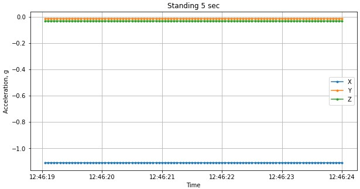
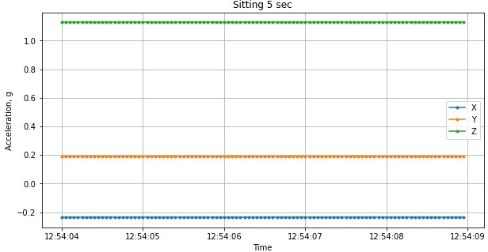

# Data visualization (exploratory)

The plots I will be discussing on this page are in previous sections described in more details.

## Plot basic activities notebook
The plots I created to gain insight in the data are in [this notebook](/evidence/notebooks/plot_basic_activities.pdf):

## Plots to test linear regression
The plots I created in [this notebook](/evidence/notebooks/linear_regression_XYZ_MET.pdf) to test the linear regression hypothesis described in [(Sasaki et al., 2016, p. 39)](https://doi.org/10.1016/b978-0-12-802075-3.00002-4):

## Plots for feature selection
One example of a plot I created in [this notebook](/evidence/notebooks/linear_regression_XYZ_MET-walking-new.pdf) to get the optimal number of features for RFE:

Note: in all the plots I try to make use of titles, X & Y labels, markers, grid and legends in order to make it easier to understand the information. 